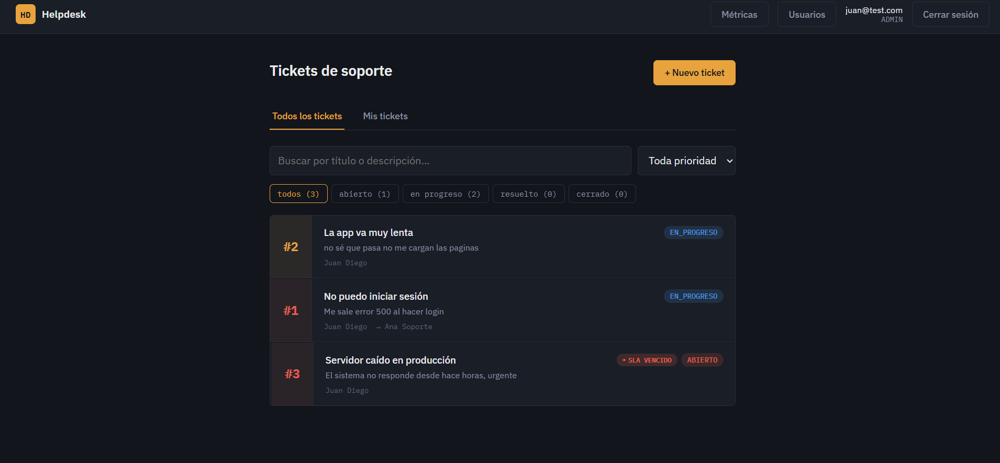
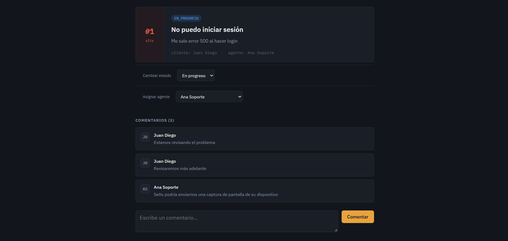
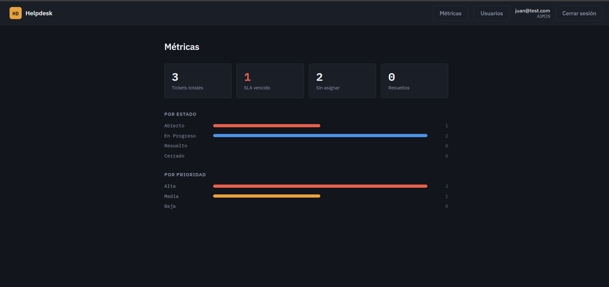
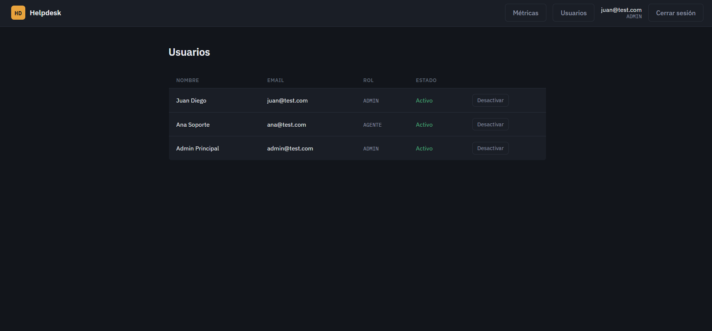

## Capturas

**Dashboard con búsqueda, filtros por prioridad y estado, y vista "Mis tickets"**


**Detalle de ticket: asignación de agente, cambio de estado y comentarios**


**Dashboard de métricas: conteo por estado, prioridad y SLA vencido**


**Panel de administración de usuarios**


# Helpdesk Frontend

Interfaz web para el sistema de tickets de soporte técnico. Cliente React que consume la API REST de [helpdesk-api-springboot](https://github.com/Juanchiz1/helpdesk-api-springboot), con autenticación JWT, control de acceso por rol, y un diseño propio inspirado en talonarios de tickets y paneles de operaciones técnicas.

## Stack técnico

- **React 18** + **Vite** — build tool y dev server
- **React Router DOM** — enrutamiento y rutas protegidas
- **Axios** — cliente HTTP con interceptores para JWT y manejo de sesión expirada
- **CSS puro** — sin frameworks de UI, diseño construido desde cero con variables CSS
- **IBM Plex Sans / IBM Plex Mono** — tipografía

## Características

- Login y registro de usuarios (cliente o agente)
- Sesión persistente vía `localStorage`, con redirección automática si el token expira o es inválido
- Rutas protegidas: contenido inaccesible sin sesión activa
- Dashboard de tickets con:
  - Búsqueda por texto (título/descripción)
  - Filtro por prioridad
  - Pestañas por estado con conteo en vivo
  - Vista "Mis tickets" (cliente ve los suyos, agente ve los asignados)
- Creación de tickets y detalle con:
  - Historial de comentarios
  - Cambio de estado
  - Asignación de agente
- Indicador de **SLA vencido**: tickets de prioridad alta sin atender en más de 4 horas se marcan visualmente, con umbrales distintos según prioridad
- Panel de administración de usuarios (solo `ADMIN`): listar cuentas, activar/desactivar
- Dashboard de métricas: conteo por estado, por prioridad, SLA vencidos, tickets sin asignar
- Diseño responsive (móvil y tablet)

## Arquitectura

```
src/
├── api/            # Cliente axios + servicios por dominio (auth, tickets, comentarios)
├── components/     # Componentes reutilizables (Layout, TicketCard)
├── context/        # AuthContext — sesión y token disponibles en toda la app
├── pages/          # Pantallas: Login, Registro, Dashboard, NuevoTicket, DetalleTicket, Usuarios, Metricas
├── routes/         # RutaProtegida — guard para rutas que requieren sesión
└── utils/          # Lógica de SLA
```

## Diseño

La interfaz se apoya en una metáfora deliberada: cada ticket se representa como un talón numerado con borde perforado, tintado según su prioridad — igual que un talonario físico. La paleta (carbón oscuro + acento ámbar) y la tipografía monoespaciada para IDs y timestamps refuerzan el carácter de herramienta técnica de operaciones, en vez de una plantilla genérica de dashboard SaaS.

## Requisitos previos

- Node.js 18+
- El backend [helpdesk-api-springboot](https://github.com/Juanchiz1/helpdesk-api-springboot) corriendo (por defecto en `http://localhost:8080`)

## Instalación

```bash
npm install
```

## Configuración

Por defecto, el cliente apunta a `http://localhost:8080/api` (definido en `src/api/axiosConfig.js`). Si tu backend corre en otra URL, ajusta el valor de `baseURL` ahí.

## Cómo correr el proyecto

```bash
npm run dev
```

La app queda disponible en `http://localhost:5173`.

## Build de producción

```bash
npm run build
```

Genera los archivos estáticos en `dist/`, listos para desplegar en cualquier hosting de archivos estáticos (Vercel, Netlify, GitHub Pages).

## Flujo de uso

1. Regístrate como `CLIENTE` o `AGENTE` desde `/registro`
2. Inicia sesión — el token JWT se guarda y se adjunta automáticamente a cada petición
3. Crea un ticket desde el dashboard
4. Un agente puede tomarlo (asignarse) desde el detalle del ticket, lo que mueve automáticamente su estado a `EN_PROGRESO`
5. Ambas partes pueden comentar en el ticket para dar seguimiento
6. Un `ADMIN` puede ver métricas globales y administrar cuentas de usuario

## Roles y permisos

| Rol | Puede |
|---|---|
| `CLIENTE` | Crear tickets, ver los suyos, comentar |
| `AGENTE` | Ver todos los tickets, asignarse tickets, cambiar estado, ver los asignados a él |
| `ADMIN` | Todo lo anterior + administrar usuarios (activar/desactivar cuentas) |

## Proyecto relacionado

- **Backend:** [helpdesk-api-springboot](https://github.com/Juanchiz1/helpdesk-api-springboot) — Spring Boot, JPA, PostgreSQL, Spring Security + JWT, Swagger, JUnit/Mockito

## Autor

**Juan Diego Negrete Portillo**
Estudiante de Ingeniería de Sistemas y Telecomunicaciones — Universidad de Córdoba
[Portafolio](https://juanchiz1.github.io/Portafolio-Juan_Diego_Negrete/) · [LinkedIn](https://www.linkedin.com/in/juan-diego-negrete-portillo-352111195/) · [GitHub](https://github.com/Juanchiz1)